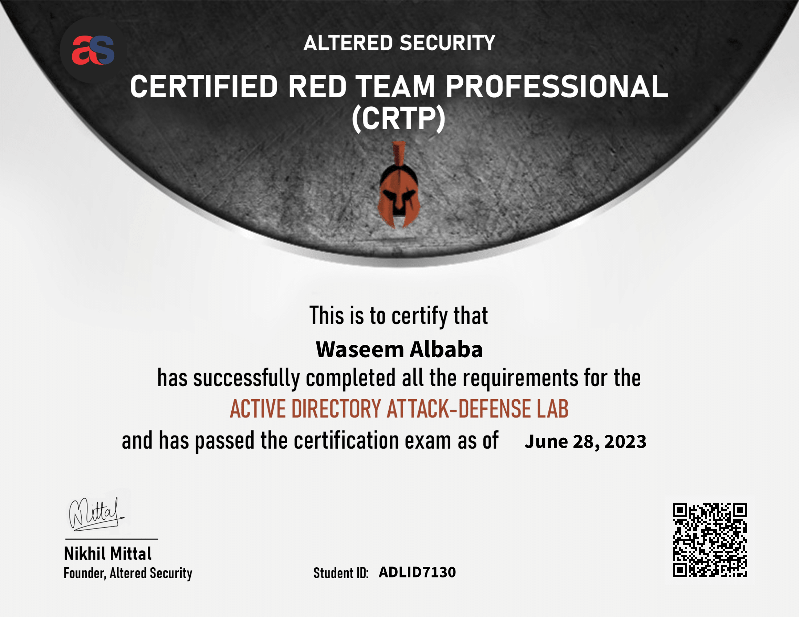
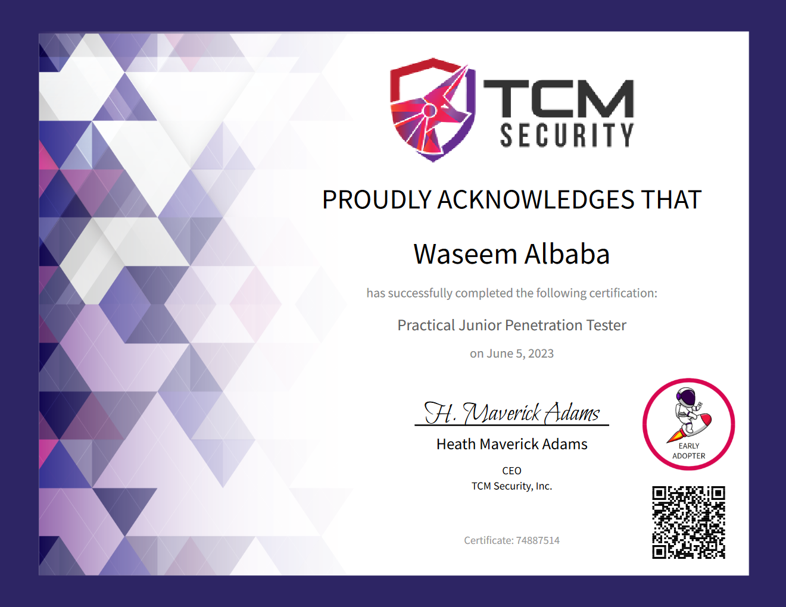

### Table of Contents
- [Offensive Security Experienced Penetration Tester](#offensive-security-experienced-penetration-tester) - OSEP
- [Offensive Security Certified Professional](#offensive-security-certified-professional) - OSCP
- [Offensive Security Web Assessor](#offensive-security-web-assessor) - OSWA
- [Offensive Security Wireless Professional](#offensive-security-wireless-professional) - OSWP
- [Kali Linux Certified Professional](#kali-linux-certified-professional) - KLCP
- [Red Team Lead](#red-team-lead) - RTL
- [Certified Red Team Operator](#certified-red-team-operator) - CRTO 
- [Hack The Box Certified Penetration Testing Specialist](#hack-the-box-certified-penetration-testing-specialist) - CPTS
- [Hack The Box Certified Bug Bounty Hunter](#hack-the-box-certified-bug-bounty-hunter) - CBBH
- [Hack The Box Certified Defensive Security Analyst](#hack-the-box-certified-defensive-security-analayst) - CDSA
- [Certified Red Team Professional](#certified-red-team-professional) - CRTP
- [Practical Network Penetration Tester](#practical-network-penetration-tester) - PNPT
- [Practical Junior Penetration Tester](#practical-junior-penetration-tester) - PJPT
- [CompTIA Security Plus](#comptia-security-plus)
- [Hack The Box Genesis Pro Lab](#hack-the-box-genesis-pro-lab)
- [Hack The Box Dante Pro Lab](#hack-the-box-dante-pro-lab)

## Offensive Security Experienced Penetration Tester

### Vendor: Offensive Security 
- Date acquired: June 2024
- Exprires: Never
- Verify: [OSEP](https://www.credential.net/162127db-4ef3-4fb7-814d-d71aa874eb66)

## Offensive Security Certified Professional

### Vendor: Offensive Security 
- Date acquired: April 2022 
- Exprires: Never
- Verify: [OSCP](https://www.credential.net/aaf2c998-78c4-4714-add1-7185a3602a91)

## Offensive Security Web Assessor

### Vendor: Offensive Security 
- Date acquired: February 2024
- Exprires: Never
- Verify: [OSWA](https://www.credential.net/19e60313-d540-407e-9ab2-4d400ab1d516)

## Offensive Security Wireless Professional

### Vendor: Offensive Security 
- Date acquired: March 2024
- Exprires: Never
- Verify: [OSWP](https://www.credential.net/ffee954b-6fbc-4acd-9611-25d983622051)

## Kali Linux Certified Professional

### Vendor: Offensive Security 
- Date acquired: February 2024 
- Exprires: Never
- Verify: [KLCP](https://www.credential.net/1857913a-1503-4522-aea7-acb1b322f286)

## Red Team Lead

### Vendor: Zero-Point Security 
- Date acquired: October 2023
- Expries: Never
- Verify: [CRTL](https://api.eu.badgr.io/public/assertions/a4EMav_CSaWQ5yhANMUqew)

## Certified Red Team Operator

### Vendor: Zero-Point Security 
- Date acquired: May 2023
- Expries: Never
- Verify: [CRTO](https://eu.badgr.com/public/assertions/zMkwZ-sjQLWBDMVP6qbyZg)

## Hack The Box Certified Penetration Testing Specialist

### Vendor: Hack The Box
- Date acquired: April 2023
- Exprires: Never
- Verify: [CPTS](https://www.credly.com/badges/fc1dae51-8b79-4c60-9f85-24dc992a7230)

## Hack The Box Certified Bug Bounty Hunter

### Vendor: Hack The Box
- Date acquired: February 2023
- Exprires: Never
- Verify: [CBBH](https://www.credly.com/badges/cd99db08-80f8-4309-9aa2-5ab54edd47a0/public_url)

## Hack The Box Certified Defensive Security Analayst

### Vendor: Hack The Box
- Date acquired: December 2023
- Exprires: Never
- Verify: [CDSA](https://www.credly.com/badges/8199f750-ceca-4900-9cc8-c3b67b6525fd/public_url)

## Certified Red Team Professional 

### Vendor: Altered Security 
- Date acquired: June 2023
- Exprires: June 2026
- Verify: [CRTP](https://www.credential.net/55133e9c-8420-4474-aabe-0385f9612c2a)

## Practical Network Penetration Tester

### Vendor: TCM Security 
- Date acquired: April 2023
- Exprires: Never
- Verify: [PNPT](https://www.credential.net/8f673747-46f1-45b7-916e-b8bf82ffafc5)

## Practical Junior Penetration Tester

### Vendor: TCM Security 
- Date acquired: April 2023
- Exprires: Never
- Verify: [PJPT](https://www.credential.net/83e803b8-50f0-4b7f-b543-8e65c021b69b)

## CompTIA Security Plus

### Vendor: CompTIA
- Date acquired: January 2023
- Exprires: January 2026
- Verify: [Sec+](https://www.credly.com/badges/ac9a43b9-51bd-43a8-855f-cdaa942c13ac/public_url)

## Hack The Box Genesis Pro Lab

### Vendor: Hack The Box
- Date acquired: March 2023
- Expires: Never
- Verify: N/A

## Hack The Box Dante Pro Lab

### Vendor: Hack The Box
- Date acquired: March 2023
- Expires: Never
- Verify: N/A

